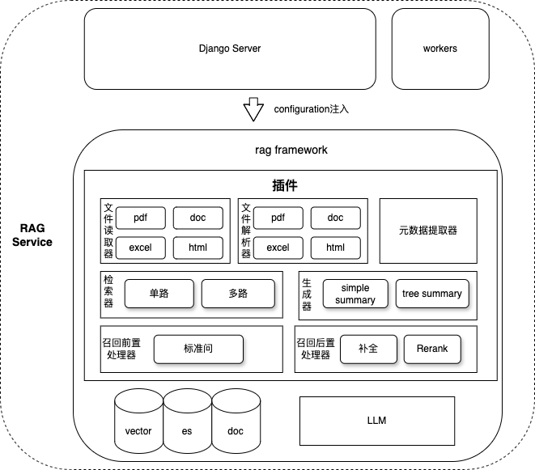
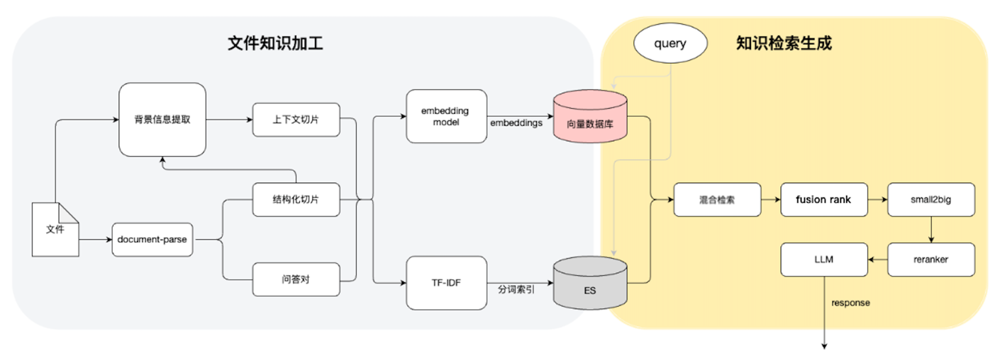

# ke-RAG

> ke-RAG是一个基于Django的开源RAG（Retrieval-Augmented Generation）框架，提供文档理解、索引构建、检索问答等完整的RAG基础能力。

## 🚀 特性

### 🏆 核心技术优势

- **🔥 业界领先的文档解析**: 文档结构化解析效果业界领先，支持复杂版面和多模态内容理解
- **🎯 高精度检索技术**: 利用多路召回和small2big技术，兼顾语义检索效果与信息完整度，多场景验证综合结果可用率 > 85%
- **🧠 Contextual RAG增强**: 支持Contextual RAG技术，在chunk编码前预先添加解释性的上下文信息，大幅提升检索准确率
- **🚀 Deep RAG智能agent模式**: 基于Planning and Solve模式的智能agent，通过自动制定执行计划（确认文件范围 -> 阅读文件 -> 反思）、步骤式执行和动态重规划，实现比传统RAG更优的问答效果
- **🔧 策略插件化架构**: 检索策略完全可插拔，调用方可根据业务场景灵活调整检索策略及参数，满足不同领域需求

### 🛠️ 系统特性

- **多格式文档支持**: 支持PDF、Word、Excel、HTML、Markdown等多种文档格式
- **向量化存储**: 集成腾讯向量数据库，提供高效的向量存储和检索
- **安全的混合架构**: 向量数据库仅存储向量，原始内容安全存储在MySQL中
- **灵活的检索策略**: 支持多种检索模式和重排序算法
- **可扩展架构**: 模块化设计，易于扩展和定制
- **完整的API**: 提供完整的RESTful API接口
- **异步处理**: 支持Kafka异步任务处理
- **可选ES支持**: 可选择集成Elasticsearch进行全文检索
- **一键初始化**: 提供自动化脚本快速完成环境配置


## 🏗️ 系统架构

### 整体架构图




### 处理流程图

*从文档上传到检索问答的完整处理流程*

### 数据存储架构

ke-RAG采用混合存储架构，将数据安全性和检索效率相结合：

**向量数据库（腾讯云向量数据库）**：
- 存储文档和问答的向量化表示
- 不存储原始文本内容（安全考虑）
- 支持高效的相似度检索
- 包含三个集合：主文档向量、QA向量、文档总结向量

**关系型数据库（MySQL）**：
- 存储文档的原始内容和元数据
- 提供结构化数据查询能力
- 确保数据的持久性和一致性

**搜索引擎（Elasticsearch，可选）**：
- 提供全文检索能力
- 补充向量检索的不足
- 支持复杂的文本查询和过滤

架构优势：
1. **安全性**：敏感文档内容不暴露在向量数据库中
2. **性能**：向量检索和关键词检索各司其职
3. **灵活性**：支持多种检索策略的组合
4. **可扩展性**：各组件可独立扩展


## ⚡ 快速开始

```bash
# 1. 克隆项目
git clone https://github.com/your-org/ke-RAG.git
cd ke-RAG

# 2. 安装依赖
pip install -r requirements.txt

# 3. 配置环境
chmod +x bin/setup_config.sh
./bin/setup_config.sh

# 4. 初始化数据库
chmod +x bin/init_db.sh
./bin/init_db.sh

# 5. 初始化向量数据库
chmod +x bin/init_vectordb.sh
./bin/init_vectordb.sh

# 6. 启动服务
./bin/run.sh run
```

## 📋 环境要求

- Python >= 3.8
- MySQL >= 5.7
- Redis >= 5.0
- 腾讯向量数据库账号
- OpenAI API密钥（或兼容的API）

## 🛠️ 安装部署

### 1. 克隆项目

```bash
git clone https://github.com/your-org/ke-RAG.git
cd ke-RAG
```

### 2. 安装依赖

```bash
# 使用pip安装
pip install -r requirements.txt

# 或使用conda
conda create -n ke-rag python=3.8
conda activate ke-rag
pip install -r requirements.txt
```

### 3. 配置文件设置

#### 方式一：使用配置向导（推荐）

```bash
# 给脚本添加执行权限
chmod +x bin/setup_config.sh

# 运行配置向导
./bin/setup_config.sh
```

配置向导会交互式地引导您设置所有必需的配置项。

#### 方式二：手动配置

复制配置模板并修改：

```bash
cp conf/config_template.ini conf/config_local.ini
```

编辑 `conf/config_local.ini` 文件，配置以下必需项：

```ini
[DB]
host = localhost
port = 3306
username = your_mysql_username
password = your_mysql_password
dbname = ke_rag

[REDIS]
host = localhost
port = 6379
password = your_redis_password
database = 0

[OPENAPI]
ak = Bearer your_openai_api_key
api_base = https://api.openai.com/v1

[VECTOR_DB]
url = your_tencent_vectordb_url
key = your_tencent_vectordb_key
database_name = your_database_name
dimension = 1024
# 主文档向量集合
collection_name = your_main_collection_name
# QA问答向量集合
questions_collection_name = your_qa_collection_name
# 文档总结向量集合
summary_question_collection_name = your_summary_collection_name
embedding_model = your_embedding_model
```

### 4. 数据库初始化

#### 方式一：使用初始化脚本（推荐）

```bash
# 给脚本添加执行权限
chmod +x bin/init_db.sh

# 运行数据库初始化脚本
./bin/init_db.sh

# 或者指定数据库连接参数
./bin/init_db.sh localhost 3306 root your_password
```

脚本会自动创建数据库和所有必需的表。

#### 方式二：手动创建

如果您希望手动创建数据库，可以按照以下步骤：

##### MySQL表创建

连接到MySQL并创建数据库：

```sql
CREATE DATABASE ke_rag CHARACTER SET utf8mb4 COLLATE utf8mb4_unicode_ci;
```

然后执行 `scripts/init_database.sql` 文件：

```bash
mysql -u root -p ke_rag < scripts/init_database.sql
```

或者手动创建必需的表：

```sql
-- 使用ke_rag数据库
USE ke_rag;

-- 创建向量化索引信息表
CREATE TABLE `chunk_content_attached` (
  `id` int(11) NOT NULL AUTO_INCREMENT,
  `source_id` varchar(128) NOT NULL COMMENT '来源的id，文件为fileId',
  `chunk_id` varchar(128) DEFAULT '' COMMENT 'chunk_id node_id',
  `content_title` text COMMENT '标题',
  `content_data` longtext COMMENT '内容',
  `token` int(11) DEFAULT '-911' COMMENT '节点及子节点token总量',
  `chunk_pos` int(11) NOT NULL COMMENT '切片的位置',
  `chunk_status` int(11) DEFAULT '1' COMMENT '切片状态',
  `order_num` varchar(128) DEFAULT '' COMMENT '切片层级信息',
  `context_id` varchar(128) DEFAULT '' COMMENT '切片管理上下文id',
  `create_time` datetime(6) DEFAULT NULL COMMENT '创建时间',
  `update_time` datetime(6) DEFAULT NULL COMMENT '更新时间',
  PRIMARY KEY (`id`),
  KEY `idx_source_id` (`source_id`),
  KEY `idx_chunk_id` (`chunk_id`)
) ENGINE=InnoDB DEFAULT CHARSET=utf8mb4 COMMENT='向量化索引信息保存';

-- 创建QA问答索引表
CREATE TABLE `question_answer_index_attached` (
  `id` int(11) NOT NULL AUTO_INCREMENT,
  `source_id` varchar(128) NOT NULL COMMENT '来源的id，文件为fileId',
  `group_id` varchar(128) NOT NULL COMMENT '问题组的概念',
  `question` text NOT NULL COMMENT '问题',
  `answer` text NOT NULL COMMENT '答案',
  `business_metadata` text COMMENT '业务元数据字段',
  `del_status` int(11) DEFAULT '0' COMMENT '删除状态',
  `ctime` datetime(6) DEFAULT NULL COMMENT '创建时间',
  `mtime` datetime(6) DEFAULT NULL COMMENT '更新时间',
  PRIMARY KEY (`id`),
  KEY `idx_source_id` (`source_id`),
  KEY `idx_group_id` (`group_id`)
) ENGINE=InnoDB DEFAULT CHARSET=utf8mb4 COMMENT='QA类型问题向量化索引信息';

-- 创建知识文件元数据表
CREATE TABLE `knowledge_file_meta` (
  `id` bigint(20) NOT NULL AUTO_INCREMENT,
  `file_id` varchar(64) DEFAULT '' COMMENT '文件ID',
  `summary_question` text COMMENT '文件总结',
  `tag` text COMMENT '业务标签',
  PRIMARY KEY (`id`),
  KEY `idx_file_id` (`file_id`)
) ENGINE=InnoDB DEFAULT CHARSET=utf8mb4 COMMENT='知识文件维度的元数据';
```

#### 腾讯向量数据库设置

1. 登录腾讯云向量数据库控制台
2. 创建数据库实例
3. 创建数据库和集合

ke-RAG需要创建三个向量集合来支持不同的检索场景：

**重要说明**：出于数据安全考虑，向量数据库中不存储文档的明文内容，仅存储向量化后的嵌入向量和必要的元数据信息。文档的实际内容存储在MySQL数据库的 `chunk_content_attached` 和 `question_answer_index_attached` 表中。

##### 集合1: 主文档向量集合
用于存储文档切片的向量信息：

```bash
curl -i -X POST \
  -H 'Content-Type: application/json' \
  -H 'Authorization: Bearer account=root&api_key=YOUR_API_KEY' \
  http://YOUR_VECTORDB_URL/collection/create \
  -d '{
    "database": "your_database_name",
    "collection": "document_vectors",
    "replicaNum": 2,
    "shardNum": 10,
    "description": "主文档向量集合",
    "indexes": [
        {
            "fieldName": "id",
            "fieldType": "string",
            "indexType": "primaryKey"
        },
        {
            "fieldName": "vector",
            "fieldType": "vector",
            "indexType": "HNSW",
            "dimension": 1024,
            "metricType": "COSINE",
            "params": {
                "M": 16,
                "efConstruction": 200
            }
        },
        {
            "fieldName": "source_id",
            "fieldType": "string",
            "indexType": "filter"
        },
        {
            "fieldName": "source_name",
            "fieldType": "string",
            "indexType": "filter"
        },
        {
            "fieldName": "node_type",
            "fieldType": "string",
            "indexType": "filter"
        },
        {
            "fieldName": "extra",
            "fieldType": "array",
            "indexType": "filter"
        },
        {
            "fieldName": "relationships",
            "fieldType": "string",
            "indexType": "filter"
        }
    ]
}'
```

##### 集合2: QA问答向量集合
用于存储问答对的向量信息：

```bash
curl -i -X POST \
  -H 'Content-Type: application/json' \
  -H 'Authorization: Bearer account=root&api_key=YOUR_API_KEY' \
  http://YOUR_VECTORDB_URL/collection/create \
  -d '{
    "database": "your_database_name",
    "collection": "qa_vectors",
    "replicaNum": 2,
    "shardNum": 10,
    "description": "QA问答向量集合",
    "indexes": [
        {
            "fieldName": "id",
            "fieldType": "string",
            "indexType": "primaryKey"
        },
        {
            "fieldName": "vector",
            "fieldType": "vector",
            "indexType": "HNSW",
            "dimension": 1024,
            "metricType": "COSINE",
            "params": {
                "M": 16,
                "efConstruction": 200
            }
        },
        {
            "fieldName": "source_id",
            "fieldType": "string",
            "indexType": "filter"
        },
        {
            "fieldName": "source_name",
            "fieldType": "string",
            "indexType": "filter"
        },
        {
            "fieldName": "group_id",
            "fieldType": "string",
            "indexType": "filter"
        },
        {
            "fieldName": "extra",
            "fieldType": "array",
            "indexType": "filter"
        }
    ]
}'
```

##### 集合3: 文档总结向量集合
用于存储文档总结问题的向量信息：

```bash
curl -i -X POST \
  -H 'Content-Type: application/json' \
  -H 'Authorization: Bearer account=root&api_key=YOUR_API_KEY' \
  http://YOUR_VECTORDB_URL/collection/create \
  -d '{
    "database": "your_database_name",
    "collection": "summary_vectors",
    "replicaNum": 2,
    "shardNum": 10,
    "description": "文档总结向量集合",
    "indexes": [
        {
            "fieldName": "id",
            "fieldType": "string",
            "indexType": "primaryKey"
        },
        {
            "fieldName": "vector",
            "fieldType": "vector",
            "indexType": "HNSW",
            "dimension": 1024,
            "metricType": "COSINE",
            "params": {
                "M": 16,
                "efConstruction": 200
            }
        },
        {
            "fieldName": "source_id",
            "fieldType": "string",
            "indexType": "filter"
        }
    ]
}'
```

**配置参数说明**：
- `dimension`: 向量维度，默认1024（需与embedding模型维度一致）
- `metricType`: 相似度计算方式，推荐使用COSINE
- `replicaNum`: 副本数，推荐设置为2提高可用性
- `shardNum`: 分片数，根据数据量调整，推荐10个分片

**创建集合API文档**：[腾讯云向量数据库创建集合API](https://cloud.tencent.com/document/product/1709/95116)

##### 使用脚本快速创建（推荐）

```bash
# 给脚本添加执行权限
chmod +x bin/init_vectordb.sh

# 运行向量数据库初始化脚本
./bin/init_vectordb.sh
```

脚本会交互式地引导您创建所有必需的向量集合。

4. 在配置文件中填写正确的：
   - 访问URL
   - API密钥
   - 数据库名称
   - 三个集合名称

#### Elasticsearch设置（可选）

Elasticsearch主要用于全文检索和补充向量检索的不足。与向量数据库不同，ES索引中包含文档的完整内容以支持关键词搜索。

**ES索引结构包含以下字段**：
- `relationships`: 文档关系信息（keyword类型，不可检索）
- `extra`: 额外元数据信息（keyword类型，可检索）
- `source_id`: 文件来源ID（keyword类型，可检索）
- `type`: 文档类型（keyword类型，可检索）
- `doc_id`: 文档ID（keyword类型，可检索）
- `content`: 文档内容（text类型，可检索，使用ik-max中文分词器）
- `source_name`: 文件名称（text类型，可检索，使用ik-max中文分词器）
- `status`: 状态字段（keyword类型，可检索）

如果需要使用Elasticsearch，请在配置文件中添加：

```ini
[ELASTICSEARCH]
hosts = http://localhost:9200
username = your_es_username
password = your_es_password
index_name = ke_rag
```

**注意**：ES的使用是完全可选的，如果不配置ES相关参数，系统将仅使用向量检索。

### 5. 启动服务

#### 使用脚本启动（推荐）

```bash
# 完整启动（包括环境检查、依赖安装、服务启动）
sh bin/run.sh run

# 仅启动服务
sh bin/run.sh start

# 停止服务
sh bin/run.sh stop
```

#### 手动启动

```bash
# 启动Django开发服务器
python manage.py runserver 0.0.0.0:8008

# 或使用gunicorn（生产环境）
gunicorn init.wsgi -c gunicorn.conf.py
```

#### 使用Docker

```bash
# 构建镜像
docker build -t ke-rag .

# 运行容器
docker run -p 8008:8008 -v ./conf:/app/conf ke-rag
```


### 🔬 技术细节

**文档解析技术**：
- 采用业界先进的结构化解析算法，支持复杂表格、图片、公式等多模态内容
- 智能版面分析，准确识别标题、段落、列表等文档结构
- 参考资源：[文档解析技术综述](docs/document_parsing_survey.md)

**多路召回策略**：
- 密集向量检索：基于语义相似度的深度检索
- 稀疏向量检索：基于关键词匹配的精确检索
- 混合检索：结合两种方式的优势，提升召回覆盖率

**Small2Big检索技术**：
- 小块检索：使用较小的chunk进行精确匹配
- 大块返回：返回包含更多上下文的较大文本块
- 平衡检索精度和信息完整性

**Contextual RAG技术**：
- 上下文预处理：为每个chunk添加文档级别的上下文描述
- 智能摘要：自动生成文档结构和主题信息
- 提升检索语义理解能力，减少断章取义

## 📚 使用指南

### API接口

服务启动后，可以通过以下接口使用：

- 健康检查: `GET /health`
- 文件上传: `POST /api/file/upload`
- 文档检索: `POST /api/rag/query`
- 问答接口: `POST /api/qa/ask`

### 配置说明

#### 必需配置

| 配置项 | 说明 | 示例 |
|--------|------|------|
| `DB.*` | MySQL数据库配置 | 见上文配置文件 |
| `REDIS.*` | Redis配置 | 见上文配置文件 |
| `OPENAPI.*` | OpenAI API配置 | 见上文配置文件 |
| `VECTOR_DB.*` | 腾讯向量数据库配置 | 见上文配置文件 |

#### 可选配置

| 配置项 | 说明 | 默认值 |
|--------|------|--------|
| `ELASTICSEARCH.*` | Elasticsearch配置 | 无 |
| `KAFKA.*` | Kafka异步任务配置 | 无 |
| `S3.*` | S3存储配置 | 无 |
| `RETRIEVAL.*` | 检索参数配置 | 见配置模板 |
| `RERANK.*` | 重排序配置 | 无 |

### 环境变量

- `CONFIG_FILE`: 指定配置文件名（如：`config_local.ini`）
- `ENVTYPE`: 环境类型（`prod`表示生产环境）
- `PORT`: 服务端口（默认8008）

## 🔧 开发指南

### 目录结构

```
ke-RAG/
├── app/                    # 主应用目录
│   ├── controllers/        # 控制器
│   ├── models/            # 数据模型
│   ├── services/          # 业务服务
│   └── workers/           # 异步任务处理
├── ke_rag/                # 核心RAG库
│   ├── transformations/   # 数据转换
│   ├── retrievals/        # 检索模块
│   └── vector_stores/     # 向量存储
├── conf/                  # 配置文件
├── bin/                   # 启动脚本
└── requirements.txt       # 依赖包
```

### 扩展开发

1. **添加新的文档解析器**：在 `ke_rag/transformations/parser/` 目录下添加新的解析器
2. **自定义检索策略**：在 `ke_rag/retrievals/` 目录下实现新的检索器
3. **扩展向量存储**：在 `ke_rag/vector_stores/` 目录下添加新的存储后端

## 🐛 故障排除

### 常见问题

1. **数据库连接失败**
   - 检查MySQL服务是否启动
   - 确认数据库配置信息是否正确
   - 检查网络连接

2. **向量数据库连接失败**
   - 确认腾讯向量数据库配置
   - 检查API密钥是否正确
   - 确认网络连接

3. **依赖安装失败**
   - 确认Python版本 >= 3.8
   - 尝试清理pip缓存：`pip cache purge`
   - 使用不同的pip源

4. **服务启动失败**
   - 检查端口是否被占用
   - 查看日志文件：`logs/django_error.log`
   - 确认所有必需配置项已填写

### 日志位置

- 应用日志：`logs/django_info.log`
- 错误日志：`logs/django_error.log`
- 访问日志：`logs/gunicorn.log`

## 📄 许可证

本项目采用 MIT 许可证，详见 [LICENSE](LICENSE) 文件。

## 🤝 贡献

欢迎提交Issue和Pull Request来帮助改进这个项目。

1. Fork 项目
2. 创建功能分支：`git checkout -b feature/your-feature`
3. 提交更改：`git commit -am 'Add some feature'`
4. 推送到分支：`git push origin feature/your-feature`
5. 提交Pull Request

## 📞 支持

如果您在使用过程中遇到问题，请：

1. 查看文档和FAQ
2. 搜索已有的Issues
3. 提交新的Issue描述问题

## 更新日志

### v1.0.0
- 初始版本发布
- 支持多种文档格式解析
- 集成腾讯向量数据库
- 提供完整的RAG API接口
