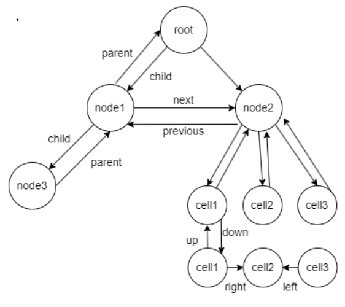

# KE-RAG Node Schema介绍

## 概述

本文档介绍了KE-RAG系统中的节点模式定义，包括各种节点类型和它们之间的关系。该模式基于LlamaIndex扩展，提供了丰富的文档结构表示能力。

## 核心实体定义

### 1. 节点关系 (DocumentNodeRelationship)

节点关系是KE-RAG系统的核心概念，定义了文档中节点之间的各种连接方式：

#### 基础文档关系
- **SOURCE**: 源文档关系，表示节点是源文档
- **PREVIOUS**: 前序关系，表示文档中的前一个节点
- **NEXT**: 后序关系，表示文档中的下一个节点  
- **PARENT**: 父子关系中的父节点
- **CHILD**: 父子关系中的子节点
- **HEAD_CHILD**: 头子节点，用于表示多个子节点的链表结构中的头节点

#### 扩展空间关系
- **LEFT**: 左侧关系，表示节点在空间布局中的左侧位置
- **RIGHT**: 右侧关系，表示节点在空间布局中的右侧位置
- **UP**: 上方关系，表示节点在空间布局中的上方位置
- **DOWN**: 下方关系，表示节点在空间布局中的下方位置

#### 上下文和补全关系
- **CONTEXTUAL**: 上下文关系，leaf节点关联的上下文节点
- **CONTEXTUAL_GROUP**: 上下文组关系，上下文节点关联的leaf节点组
- **COMPLETE_GROUP**: 补全组关系，节点补全时关联的节点组

### 2. 元数据模式 (MetadataMode)

定义了节点内容在不同使用场景下使用的内容：

- **EMBED**: 向量化输入内容
- **LLM**: 大语言模型输入内容
- **RERANK**: 重排序模型输入内容

### 3. 节点类型层次结构

#### BaseNode (基础节点)
所有节点的祖先，就像是一个"抽象概念"，定义了所有节点都应该具备的基本能力：知道自己是什么类型、能提供完整内容、有唯一标识。

#### StructureNode (结构化节点)


在基础节点的基础上，增加了"结构感知"能力。它知道自己在文档中的位置（比如是第1.2.3节），能统计子树包含多少token量，最重要的是能记住与其他节点的各种关系。就像一个有社交能力的节点，知道谁是自己的邻居、父母、孩子。

#### TextNode (文本节点)
专门处理文字内容的节点。它的特殊之处在于，当需要生成答案时，如果文本中提到了图片，它会自动把图片的文字描述也加进来，让内容更完整。

#### ImageNode (图像节点)
专门处理图片的节点。它很聪明：
- 对于搜索排序，它提供图片中识别出的文字
- 对于生成回答，它提供图片链接加上文字描述的组合
- 这样既能被搜索到，又能在回答中正确显示

#### TabelNode (表格节点)
专门处理表格的节点，本质上是文本节点的特殊版本，额外记录了表格的结构信息，知道自己属于哪个单元格。

#### QaNode (问答节点)
专门存储问答对的节点。它把问题和答案分开存储，搜索时用问题匹配，回答时提供完整的问答内容。还支持分组管理和业务扩展信息。

### 4. 评分节点 (NodeWithScore)

给节点增加了"评分"。它支持节点多维度的分数指标：
- 语义相似度分数：向量相似度打分
- 重排序分数：rerank模型打分
- 关键词分数：bm2.5打分

## 关系使用场景

### 文档结构表示
使用PARENT/CHILD关系构建文档的层次结构，PREVIOUS/NEXT关系维护同级节点的顺序。

### 空间布局表示
使用LEFT/RIGHT/UP/DOWN关系表示节点在二维空间中的相对位置，特别适用于表格、图表等结构化内容。

### 上下文增强
- CONTEXTUAL关系：将leaf节点与其上下文节点关联
- CONTEXTUAL_GROUP关系：将上下文节点与相关的leaf节点组关联
- COMPLETE_GROUP关系：在内容补全时关联相关节点

### 链式结构
使用HEAD_CHILD关系处理具有多个子节点且子节点为链表形式的复杂结构。

## 实用工具

系统提供了一些便利的判断方法：
- **同级关系判断**：能识别哪些关系表示节点处于同一层级（如兄弟关系、空间相邻关系）
- **上下文节点判断**：能快速识别哪些节点负责提供上下文信息

## 使用示例

### 构建文档层次结构
```python
# 创建父子关系
parent_node.doc_relationships[DocumentNodeRelationship.CHILD] = child_node
child_node.doc_relationships[DocumentNodeRelationship.PARENT] = parent_node

# 创建兄弟关系
node1.doc_relationships[DocumentNodeRelationship.NEXT] = node2
node2.doc_relationships[DocumentNodeRelationship.PREVIOUS] = node1
```

### 处理表格空间关系
```python
# 表格单元格的空间关系
cell_a1.doc_relationships[DocumentNodeRelationship.RIGHT] = cell_b1
cell_a1.doc_relationships[DocumentNodeRelationship.DOWN] = cell_a2
```

### 上下文补全
```python
# 为文本节点添加图片补全信息
text_node.extend_complete_group_nodes([image_node])
complete_content = text_node.get_complete_content(MetadataMode.LLM)
```

## 设计特点

1. **类型安全**: 使用枚举定义关系类型，避免字符串错误
2. **扩展性**: 支持自定义关系类型和节点属性
3. **多模态支持**: 统一处理文本、图像、表格等不同类型内容
4. **上下文感知**: 支持复杂的上下文关系建模
5. **评分机制**: 集成多种相关性评分方法
6. **内容自适应**: 根据不同场景提供不同的内容展示形式

这种设计使得KE-RAG能够精确表示复杂文档的结构和语义关系，为高质量的检索和生成提供基础。 